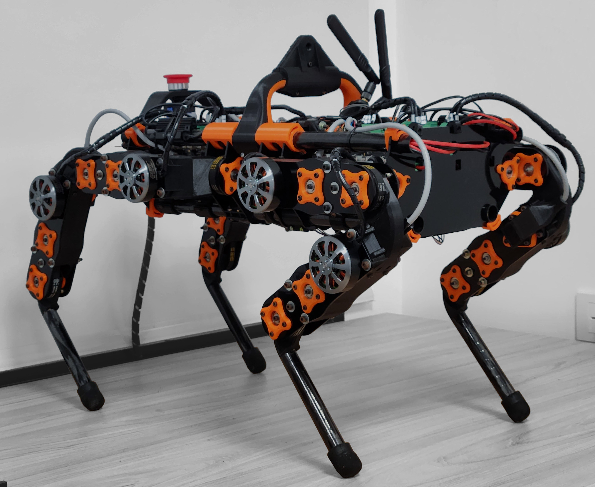
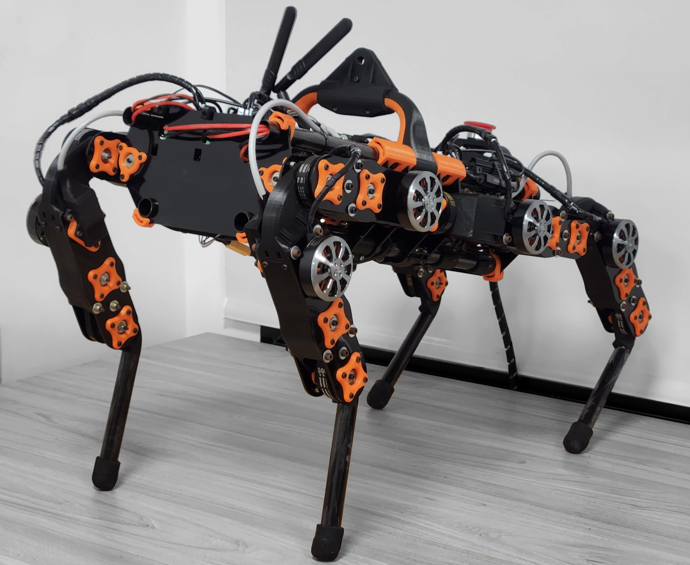

<h1 align="center">Dyna1 (pagina en construcción)</h3>
<h3 align="center">Plataforma cuadrúpeda para evaluación de algorítmos de locomoción autónom</h3>

  
  

## Descripción

 Presentamos un nuevo diseño de cuadrúpedo de 12 grados de libertad, centrado en reducir el costo y la complejidad de fabricación, y maximizar el uso de componentes disponibles regionalmente. Para facilitar el ensamblado las piernas son modulares, y los motores están lo mas cerca posible del cuerpo para reducir su inercia. Se utilizan motores brushless junto a los controladores Odrive que permiten un control simple con su interfaz por CAN. El cuerpo contiene los motores de los hombros y toda la electónica necesaria para su funcionamiento. La estructura del mismo consta de cuatro barras y placas de acrílico transversales. Para controlar el cuadrúpedo se implementa el sistema operativo ROS2. Todos los proceso cruciales para el funcionamiento del robot se corren en la computadora a bordo, y los demas en la computadora externa. Se demostró experimentalmente que la pierna es capaz de saltar hasta 30 cm con un peso similar a un cuarto del cuerpo. La el período de control (12 ms) y medición (10 ms) se alcanza con un desvío estándar de 0.135 ms y 0.246 ms respectivamente, y las corriente RMS al caminar ronda los 15 A en el motor más exigido, por lo que no debería tener problemas de calentamiento. Se creó un simulador en Pybullet para evaluar algoritmos de autonomía de manera eficiente.  

## Hardware

Los modelos 3d del robot pueden encontrarse en el siguiente link de drive: [LINK](https://drive.google.com/drive/folders/1FCLbqZc1CY9Qmqhhmpl-5FUQIIOlaMu-?usp=sharing).

En la carpeta se pueden encontrar los modelos en formato:
- Fusion 360 (.f3d)
- Step (.stp)

También podrán encontrar el listado de componentes en la carpeta de Hardware de este repositorio, como a su vez el instructivo de construcción y armado del robót.

## Software

La carpeta de Software contiene todas las clases de Python necesarias para el proceso de calibración e iniciación del cuadrúpedo, los paquetes de ROS2, y las instrucciones de uso.
