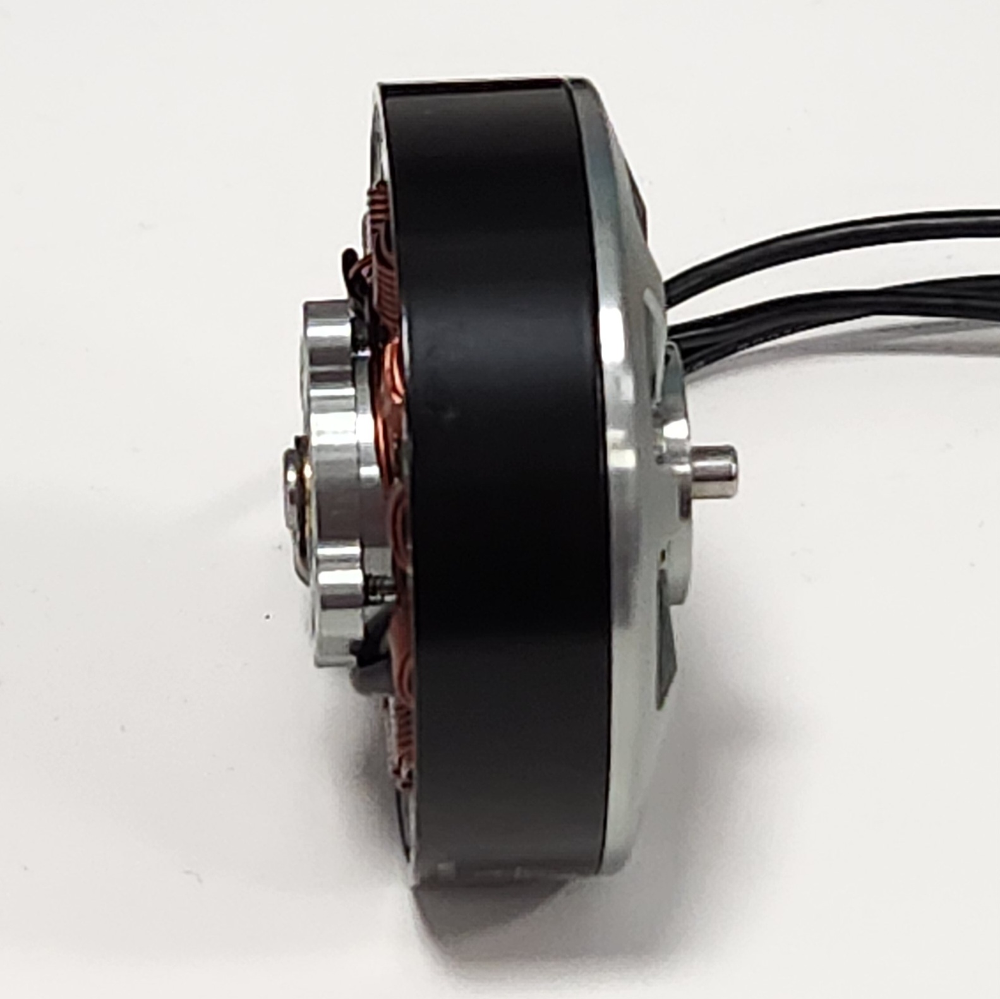
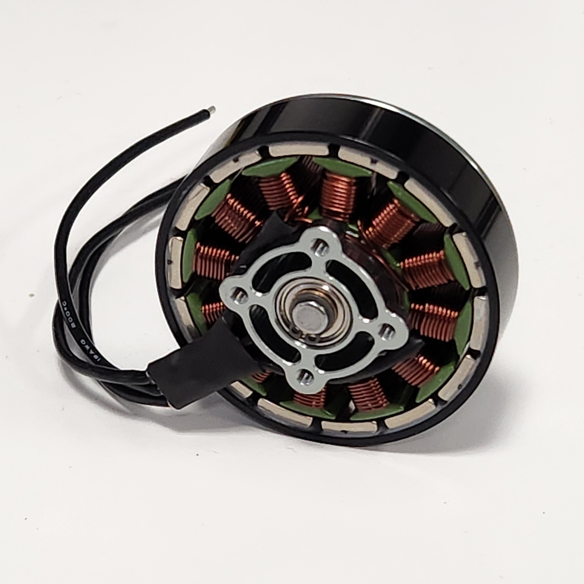
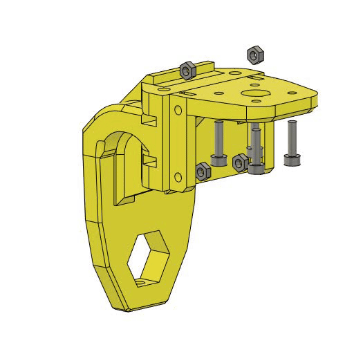
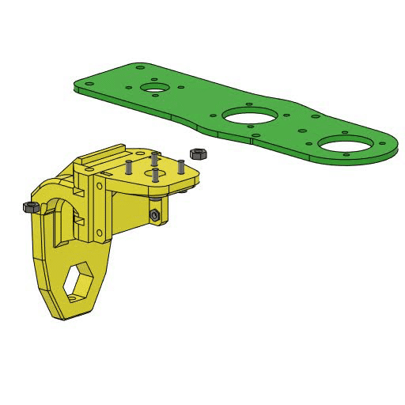
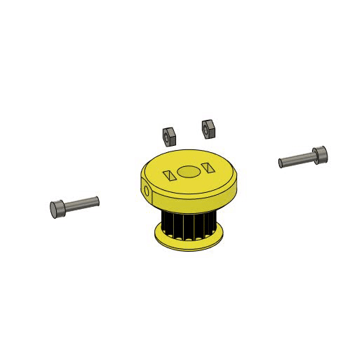
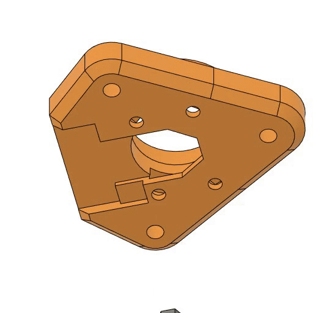
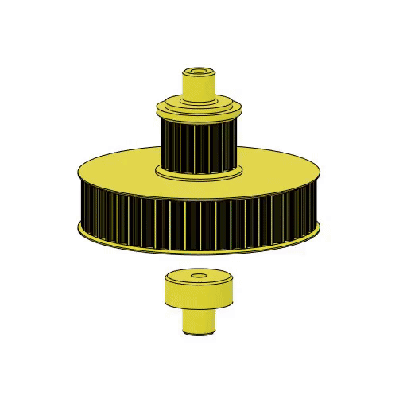
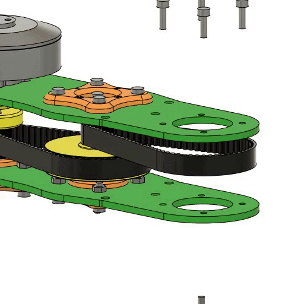

### Intervención de motores

Los motores brushless ML5010 y la mayoría de los motores brushless tienen el eje muy corto. 

  
  

Es por esto que es necesario removerlo y reemplazarlo por otro. En el caso de los ML5010 primero hay que remover la arandela que sostiene el cuerpo del motor. El eje se sostiene a la corona de imanes por medio de fricción y un prisionero. Un esquema del como debe ser el eje que lo reemplace puede encontrarse en esta carpeta. Se recomienda que le agregue conectores bullet a los cables de las tres faces para su posterior conección con los controladores.

### Metodología de armado general

Con el motoro intervenido podemos comenzar a armar el módulo reductor. A seguir se presenta la metodología estándar. Para formar todos los módulos o el cuerpo se podrá seguir estos pasos, modificando que piezas de utilizan. 

#### Paso 1

Primero se agregan las tuercas M3 a la pieza trasera del módulo, como a su vez los bulones que sostendrán al motor brushless. Se recomienda asegurar que los bulones pueden rotar libremente sin fuerza para facilitar la posterior instalación del motor.

  

#### Paso 2

A seguir se puede colocar la placa superior, los bulones que la sostienen y el motor brushless. Es importante colocar los bulones de la placa primero ya que con el motor instalado no se pueden agregar.

  

#### Paso 3

Antes de colocar la primera polea se recomienda colocar las tuercas M2.5 y los bulones M2.5. Asegurese de que no se restrinja el paso del eje del motor dejando los bulones unos mm fuera de su rosca máxima.

  

#### Paso 4

Coloque las tuercas M2.5 en el alojamiento del encoder. Luego encastre el rodamiento 626zz. Inserte la polea inicial al eje del motor, agregue la correa y coloque la placa inferior. A seguir coloque el alojamiento y asegurelo con los bulones y tuercas M3.

  

#### Paso 5

Para facilitar la instalación del imán puede imprimir la pieza cilíndrica. Se recomienda además agregar una gota de loctite al momento de instalar para que el iman quede fijo al eje. Asegurese de que el pegamento no pase al rodamiento y que además el imán quede correctamente centrado para no perjudicar la medición del encoder.

  

#### Paso 6

Se recomienda colocar la polea central ya armada. Para eso agreuge los rodamientos a cada lado y comprima con el bulon M3. Luego inserte el rodamiento dentro del módulo. Asegurese de colocar correctamente la primera y segunda correa. Sostenga a la polea con los alojamientos. Para tensionar la correa puede rotar los alojamientos en las orientaciones marcadas. Cuanto mayor el número que apunta al motor más tensionada estará la correa. Para nuestro robot la primer polea se encuentra en posición 1 y la segunda en posición 2.

  

#### Paso 7

Coloque la pieza central del módulo y la última polea. Asegurese de que quede bien encastrada la correa. Agregue los alojamientos y fíjelos. Agregue los bulones M4 y las placas laterales para rigidizar la estructura. No olvide atornillar los extremos traseros de las placas laterales.

  

